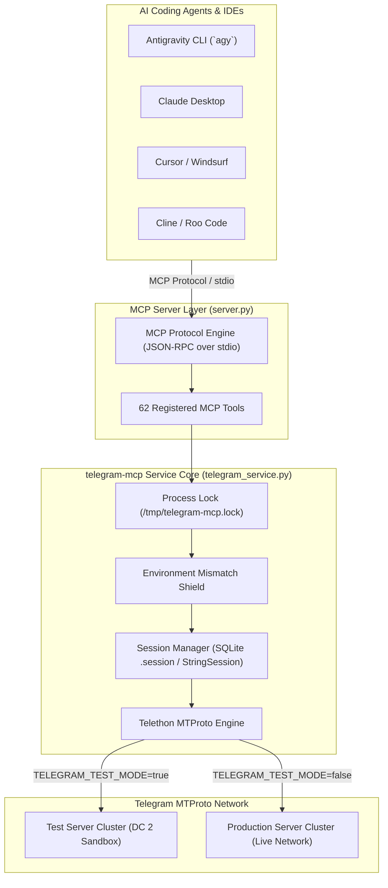

<div align="center">

# 🤖 Telegram MCP

### Autonomous Bot Testing, Automation & MTProto Control for AI Coding Agents

[](https://www.python.org/downloads/)
[](https://modelcontextprotocol.io)
[](https://github.com/LonamiWebs/Telethon)
[](https://opensource.org/licenses/MIT)
[](https://docs.pytest.org/)
[](https://github.com/Telegram-mcp/telegram-mcp-cli)

<p align="center">
  <b>A production-grade Model Context Protocol (MCP) server enabling AI Coding Agents to interact with, test, click buttons on, and verify Telegram bots end-to-end.</b><br>
  Equipped with 62 specialized MCP tools, SQLite <code>.session</code> file support, inline/reply keyboard interaction, Telegram Mini App URL extraction, and arbitrary MTProto sandboxing.
</p>

</div>

---

> [!WARNING]
> **Disclaimer**: This project is an independent open-source tool and is **not affiliated with, authorized, maintained, sponsored, or endorsed by Telegram FZ-LLC, Telegram Messenger Inc., or any of their affiliates**. "Telegram" is a registered trademark of its respective owners.

> [!TIP]
> **Environment Recommendation**: We strongly recommend using the **Test Server** (`TELEGRAM_TEST_MODE=true`) for active bot development and automated verification. It carries **zero risk to your main personal Telegram account**. Make sure your target bot and user account are on the same environment (Test Bot ↔ Test Account, or Prod Bot ↔ Prod Account).

---

## 📑 Table of Contents

- [🌟 Features](#-features)
- [🏗️ System Architecture](#️-system-architecture)
- [⚡ Companion Terminal CLI (`tg-cli`)](#-companion-terminal-cli-tg-cli)
- [🚀 Setup & Installation](#-setup--installation)
  - [Option A: 🤖 Automated Setup via AI Agent](#option-a--automated-setup-via-ai-agent-recommended)
  - [Option B: 🛠️ Manual Setup](#option-b-️-manual-setup)
- [🔌 Connecting to AI Agents](#-connecting-to-ai-agents)
  - [Antigravity CLI (`agy`)](#antigravity-cli-agy)
  - [Claude Desktop](#claude-desktop)
  - [Cursor / Cline / Roo Code / Windsurf](#cursor--cline--roo-code--windsurf)
- [🛠️ MCP Tools Matrix (62 Tools)](#️-mcp-tools-matrix-62-tools)
- [🧪 Example Multi-Step Test Scenario](#-example-multi-step-test-scenario)
- [🛡️ Security & Session Protection](#️-security--session-protection)
- [🔬 Running Unit Tests](#-running-unit-tests)
- [📄 License](#-license)

---

## 🌟 Features

* 💬 **Autonomous Bot Interaction**: Send commands (`/start`, `/help`), dispatch formatted Markdown/HTML messages, quote text, and await bot replies.
* 🎛️ **Keyboards & Telegram Mini Apps**: Click inline keyboard buttons (`CallbackQuery`), click bottom reply buttons (`ReplyKeyboardMarkup`), and extract authenticated Web App launch URLs (`messages.RequestWebViewRequest`) for Playwright/browser testing.
* 🖼️ **Rich Media & File Verification**: Upload documents, photos, audio, or circular voice notes, and download bot-generated media for visual and payload verification.
* 🗳️ **Native Polls & Quizzes**: Dispatch single/multi-choice polls and programmatically vote or retract votes.
* 👥 **Chat Moderation & Admin Event Log**: Inspect administrative audit logs (bans, kicks, permissions, title changes, deletions), create disposable test supergroups, and manage invite links.
* ⚡ **Arbitrary MTProto Execution Sandbox (`telegram_execute_code`)**: Direct access to the live `Telethon.TelegramClient` instance, raw TL functions, types, and event streams.
* 🛡️ **Dual-Mode Session Auth & Mismatch Shield**: Connect using either interactive `StringSession` or existing SQLite `.session` file paths, protected by an automatic DC environment mismatch shield.

---

## 🏗️ System Architecture



---

## ⚡ Companion Terminal CLI (`tg-cli`)

Looking for a human-friendly command-line interface to test bots, inspect chat history, and switch sessions directly from your terminal?

Check out **[`telegram-mcp-cli`](https://github.com/Telegram-mcp/telegram-mcp-cli)**:

```bash
# Install the companion CLI
pip install git+https://github.com/Telegram-mcp/telegram-mcp-cli.git

# Point directly to any existing Telethon .session file
tg-cli auth /path/to/my_account.session

# Inspect connection & environment alignment
tg-cli status

# Send commands and inspect responses
tg-cli command @BotFather /start
```

---

## 🚀 Setup & Installation

### Option A: 🤖 Automated Setup via AI Agent (Recommended)

Paste this prompt directly into your AI assistant (**Antigravity CLI**, **Cursor**, **Claude Code**, **Cline**, **Roo Code**, or **Windsurf**):

> [!TIP]
> **Copy-Paste Prompt for your AI Assistant:**
>
> ```text
> Set up the Telegram MCP server for me:
> 1. Clone & Navigate: Check if the repository is already present; if not, clone it and enter the directory:
>    git clone https://github.com/Telegram-mcp/telegram-mcp.git
>    cd telegram-mcp
> 2. Dependencies: Ensure Python 3.10+ is available and install dependencies:
>    pip install -r requirements.txt
> 3. Configuration: Copy `.env.example` to `.env`. Prompt me for my Telegram `TELEGRAM_API_ID` and `TELEGRAM_API_HASH` (from https://my.telegram.org), and ask whether I prefer Test Server (`TELEGRAM_TEST_MODE=true`, recommended) or Production (`false`).
> 4. Telegram Login: Run `python3 login.py` interactively so I can authenticate, or let me specify an existing `TELEGRAM_SESSION_PATH`.
> 5. MCP Registration: Register this MCP server in my AI client configuration:
>    - Command: `python3`
>    - Args: `["<absolute-path-to-telegram-mcp>/server.py"]`
> 6. Verification: Call `telegram_status` to verify that the connection is healthy and all 62 tools are loaded.
> ```

---

### Option B: 🛠️ Manual Setup

#### 1. Clone & Install Dependencies

```bash
git clone https://github.com/Telegram-mcp/telegram-mcp.git
cd telegram-mcp
pip install -r requirements.txt
```

#### 2. Configure Environment

Copy `.env.example` to `.env`:

```bash
cp .env.example .env
```

Add your Telegram API credentials from [my.telegram.org](https://my.telegram.org):

```ini
TELEGRAM_API_ID=your_api_id
TELEGRAM_API_HASH=your_api_hash
TELEGRAM_TEST_MODE=true
```

#### 3. Configure Telegram Session

Choose either authentication method:

* **Method 1 (Interactive Phone/QR Login)**:
  ```bash
  python3 login.py
  ```
  Generates and saves your `TELEGRAM_SESSION` string into `.env`.

* **Method 2 (Direct `.session` SQLite File)**:
  If you already have an existing Telethon `.session` file:
  ```ini
  TELEGRAM_SESSION_PATH=/absolute/path/to/your.session
  ```
  *(The server will automatically load and authorize directly from your file without running `login.py`)*.

#### 4. Run the MCP Server

```bash
python3 server.py
```

---

## 🔌 Connecting to AI Agents

### Antigravity CLI (`agy`)
The repository includes a pre-configured `.agents/plugins/telegram-bot/` plugin. Any `agy` session started in this workspace automatically discovers and loads the tools.

### Claude Desktop
Add to your `claude_desktop_config.json`:

```json
{
  "mcpServers": {
    "telegram-bot": {
      "command": "python3",
      "args": ["/path/to/telegram-mcp/server.py"],
      "env": {
        "TELEGRAM_API_ID": "your_api_id",
        "TELEGRAM_API_HASH": "your_api_hash",
        "TELEGRAM_SESSION": "your_session_string",
        "TELEGRAM_SESSION_PATH": "/path/to/your.session",
        "TELEGRAM_TEST_MODE": "false"
      }
    }
  }
}
```

### Cursor / Cline / Roo Code / Windsurf
Add to your `.cursor/mcp.json` or Cline/Roo MCP settings:

```json
{
  "mcpServers": {
    "telegram-bot": {
      "command": "python3",
      "args": ["/path/to/telegram-mcp/server.py"]
    }
  }
}
```

---

## 🛠️ MCP Tools Matrix (62 Tools)

<details open>
<summary><b>💬 Messaging, Commands & Replies</b></summary>

| Tool Name | Parameters | Description |
| :--- | :--- | :--- |
| `telegram_send_command` | `bot_username`, `command`, `wait_response?`, `timeout_seconds?` | Sends `/start`, `/help`, etc. and receives bot reply with button metadata. |
| `telegram_send_message` | `bot_username`, `text`, `reply_to_msg_id?`, `parse_mode?` | Sends formatted text queries or messages (Markdown/HTML). |
| `telegram_edit_message` | `bot_username`, `message_id`, `new_text`, `parse_mode?` | Edits previously sent messages. |
| `telegram_delete_messages` | `bot_username`, `message_ids`, `revoke?` | Deletes messages by ID. |
| `telegram_forward_messages` | `to_chat`, `from_chat`, `message_ids` | Forwards messages between chats. |
| `telegram_send_reaction` | `bot_username`, `message_id`, `reaction` | Sends emoji reactions (👍, 🔥, ❤️, etc.). |
| `telegram_click_reply_button` | `bot_username`, `button_text?`, `button_index?` | Clicks buttons in persistent bottom reply keyboards. |
| `telegram_send_and_verify` | `bot_username`, `input_text`, `expected_contains` | Single-step assertion check for automated tests. |
| `telegram_run_test_suite` | `bot_username`, `steps` | Runs multi-step test workflows with assertions and delays. |

</details>

<details>
<summary><b>🎛️ Interactive Buttons, Mini Apps & Waiting</b></summary>

| Tool Name | Parameters | Description |
| :--- | :--- | :--- |
| `telegram_click_inline_button` | `bot_username`, `message_id?`, `button_text?`, `button_index?` | Triggers inline keyboard callback queries. |
| `telegram_inline_query` | `bot_username`, `query` | Tests `@bot query` inline modes and inspects results. |
| `telegram_get_web_app_url` | `bot_username`, `message_id?`, `button_text?`, `button_index?` | Extracts authenticated Web App launch URLs from Telegram Mini App buttons. |
| `telegram_wait_for` | `bot_username`, `text_contains?`, `after_message_id?`, `wait_for_edit?` | Explicitly waits for incoming bot replies or message edits. |
| `telegram_send_chat_action` | `bot_username`, `action?` | Broadcasts chat presence indicators (`typing`, `upload_photo`, etc.). |

</details>

<details>
<summary><b>🖼️ Media, Photos, Audio & Location</b></summary>

| Tool Name | Parameters | Description |
| :--- | :--- | :--- |
| `telegram_send_file` | `bot_username`, `file_path`, `caption?`, `voice_note?` | Sends photos, documents, audio, or circular voice notes. |
| `telegram_send_album` | `bot_username`, `file_paths`, `caption?` | Sends multiple media files grouped as an album. |
| `telegram_download_media` | `bot_username`, `message_id`, `output_dir?` | Downloads media attachments from bot messages. |
| `telegram_download_profile_photo` | `bot_username`, `output_dir?` | Downloads avatars/profile photos of users, bots, or groups. |
| `telegram_search_media` | `bot_username`, `media_type?`, `query?`, `limit?` | Searches chat history filtered by specific media types. |
| `telegram_send_location` | `bot_username`, `latitude`, `longitude`, `title?`, `address?` | Sends geographic coordinates or named venues. |

</details>

<details>
<summary><b>🗳️ Polls & Quizzes</b></summary>

| Tool Name | Parameters | Description |
| :--- | :--- | :--- |
| `telegram_send_poll` | `bot_username`, `question`, `options`, `is_quiz?`, `correct_option_id?` | Creates native polls or quiz questions. |
| `telegram_vote_poll` | `bot_username`, `message_id`, `option_index` | Votes on a poll or quiz option. |
| `telegram_retract_vote` | `bot_username`, `message_id` | Retracts a previously cast vote. |

</details>

<details>
<summary><b>👥 Chat Management, Moderation & Admin Logs</b></summary>

| Tool Name | Parameters | Description |
| :--- | :--- | :--- |
| `telegram_get_admin_log` | `chat_identifier`, `limit?`, `query?`, `ban?`, `kick?`, `edit?`, `delete?` | Inspects administrative audit logs of supergroups/channels. |
| `telegram_edit_chat_info` | `chat_identifier`, `title?`, `about?` | Programmatically updates chat title or description text. |
| `telegram_create_chat` | `title`, `about?`, `megagroup?`, `for_forum?` | Creates disposable test supergroups, channels, or forum supergroups. |
| `telegram_delete_chat` | `chat_identifier` | Permanently deletes a channel or supergroup. |
| `telegram_create_invite_link` | `chat_identifier`, `title?`, `expire_in_seconds?`, `usage_limit?` | Generates customizable chat invite links. |
| `telegram_join_chat` | `chat_identifier` | Joins public channels or private chats via invite links. |
| `telegram_leave_chat` | `chat_identifier` | Leaves a channel or group. |
| `telegram_get_chat_members` | `bot_username`, `limit?` | Lists group participants with IDs, roles, and bot flags. |
| `telegram_get_participant_permissions` | `chat_identifier`, `user_identifier` | Inspects admin rights and restriction rules of a chat member. |
| `telegram_block_peer` | `peer_identifier` | Blocks a user or bot. |
| `telegram_unblock_peer` | `peer_identifier` | Unblocks a previously blocked peer. |
| `telegram_get_blocked_peers` | `limit?` | Retrieves list of all currently blocked peers. |

</details>

<details>
<summary><b>📁 Organization, Dialogs & History</b></summary>

| Tool Name | Parameters | Description |
| :--- | :--- | :--- |
| `telegram_list_dialogs` | `limit?` | Lists recent chats, groups, bots, and channels with unread counts. |
| `telegram_get_chat_history` | `bot_username`, `limit?` | Retrieves conversation history with full message structure. |
| `telegram_get_message_context` | `bot_username`, `message_id`, `limit_before?`, `limit_after?` | Fetches surrounding conversation context around a message. |
| `telegram_search_messages` | `bot_username`, `query`, `limit?` | Searches message history by keyword. |
| `telegram_export_chat` | `bot_username`, `limit?`, `format?` | Exports conversation history as clean Markdown or JSON for AI processing. |
| `telegram_clear_chat` | `bot_username` | Clears dialog history for clean test states. |
| `telegram_mark_chat_read` | `bot_username`, `max_id?` | Marks messages in a chat as read. |
| `telegram_pin_message` | `bot_username`, `message_id`, `notify?` | Pins messages in bot or group chats. |
| `telegram_unpin_message` | `bot_username`, `message_id?` | Unpins messages in a chat. |
| `telegram_get_pinned_messages` | `bot_username`, `limit?` | Retrieves pinned messages from any chat. |
| `telegram_save_draft` | `bot_username`, `text`, `reply_to_msg_id?` | Saves an uncommitted draft into the chat input field. |
| `telegram_schedule_message` | `bot_username`, `text`, `schedule_in_seconds?` | Schedules future automated delivery of a message. |
| `telegram_get_scheduled_messages` | `bot_username` | Retrieves queued scheduled messages. |
| `telegram_delete_scheduled_messages` | `bot_username`, `message_ids` | Cancels scheduled messages. |
| `telegram_mute_chat` | `bot_username`, `duration_seconds?` | Mutes chat notifications. |
| `telegram_unmute_chat` | `bot_username` | Unmutes notifications. |
| `telegram_get_dialog_filters` | _None_ | Retrieves configured Telegram chat folders/filters. |
| `telegram_create_dialog_filter` | `title`, `emoticon?`, `filter_id?`, `bots?`, `groups?` | Creates a new Telegram chat folder/filter. |
| `telegram_delete_dialog_filter` | `filter_id` | Deletes a Telegram chat folder/filter by ID. |
| `telegram_send_saved_message` | `text?`, `file_path?` | Writes directly to Telegram 'Saved Messages' cloud chat. |
| `telegram_get_saved_messages` | `limit?` | Reads notes and artifacts from Telegram 'Saved Messages'. |
| `telegram_get_contacts` | `query?`, `limit?` | Retrieves saved contacts with privacy-masked phone numbers. |

</details>

<details>
<summary><b>⚡ MTProto Sandbox & Diagnostics</b></summary>

| Tool Name | Parameters | Description |
| :--- | :--- | :--- |
| `telegram_status` | _None_ | Diagnostics for connection health, session mode, environment match, and user profile. |
| `telegram_execute_code` | `code`, `timeout_seconds?` | Executes arbitrary Python code with direct access to `client`, `functions`, and `types`. |
| `telegram_get_bot_info` | `bot_username` | Retrieves registered commands, description, and about text. |
| `telegram_get_user_profile` | `user_identifier` | Inspects full user/bot profile metadata, Premium badge, and verification status. |
| `telegram_resolve_peer` | `peer` | Resolves username, phone, or ID into detailed entity metadata. |

</details>

---

## 🧪 Example Multi-Step Test Scenario

Using `telegram_run_test_suite`, an AI agent can execute an entire regression scenario in a single tool call:

```json
[
  {"action": "send", "text": "/start"},
  {"action": "sleep", "seconds": 1.0},
  {"action": "assert_reply", "contains": "Welcome to my bot!"},
  {"action": "click_button", "text": "Settings"},
  {"action": "sleep", "seconds": 0.5},
  {"action": "assert_reply", "contains": "Notification Preferences"}
]
```

---

## 🛡️ Security & Session Protection

* **Exclusive Process Lock (`/tmp/telegram-mcp.lock`)**: Telegram permanently revokes session keys on duplicate connections (`AuthKeyDuplicatedError`). The server uses an OS-level flock to ensure no two processes run concurrently.
* **Environment Mismatch Shield**: Automatically inspects the Data Center IP of the session. If `TELEGRAM_TEST_MODE` does not match the session cluster (Test vs. Production), the server halts with a clear error before Telegram rejects the key.
* **Phone Privacy**: User phone numbers are masked (`+16 ***** 4502`) in all status outputs and logs.

---

## 🔬 Running Unit Tests

Run the test suite with `pytest`:

```bash
pip install -r requirements-dev.txt
python3 -m pytest tests -v
```

---

## 📄 License

This project is open source under the [MIT License](LICENSE).
