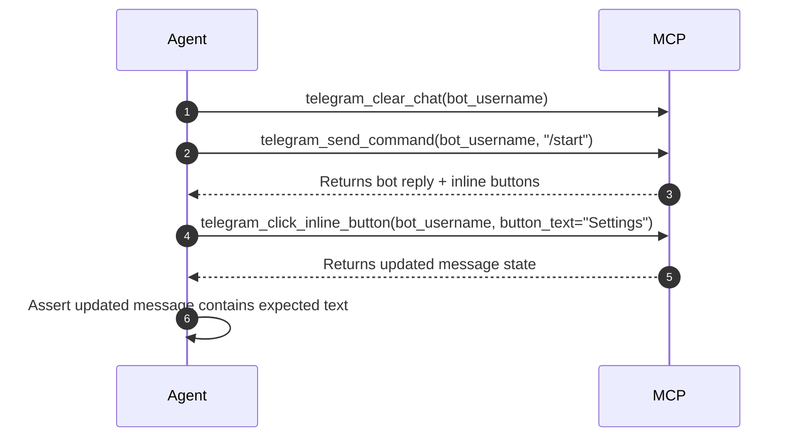

# AI Agent Guide: Telegram Bot Testing & Verification MCP

This guide teaches AI Coding Agents (such as Antigravity, Claude, Cursor, and custom LLM agents) how to interact with Telegram bots using the `telegram-bot` MCP server.

---

## 🎯 When to Use Which Tool

| Scenario | Recommended MCP Tool | Example Call |
| :--- | :--- | :--- |
| **Test a `/command`** | `telegram_send_command` | `telegram_send_command(bot_username="@my_bot", command="/start")` |
| **Send text / test query** | `telegram_send_message` | `telegram_send_message(bot_username="@my_bot", text="Hello")` |
| **Click an inline button** | `telegram_click_inline_button` | `telegram_click_inline_button(bot_username="@my_bot", button_text="Settings")` |
| **Send a test file / image** | `telegram_send_file` | `telegram_send_file(bot_username="@my_bot", file_path="/path/to/test.jpg")` |
| **Inspect a file sent by bot** | `telegram_download_media` | `telegram_download_media(bot_username="@my_bot", message_id=1234)` |
| **Test `@bot query` inline mode**| `telegram_inline_query` | `telegram_inline_query(bot_username="@my_bot", query="search terms")` |
| **Run a multi-step test flow** | `telegram_run_test_suite` | `telegram_run_test_suite(bot_username="@my_bot", steps=[...])` |
| **Custom logic / MTProto calls** | `telegram_execute_code` | `telegram_execute_code(code="me = await client.get_me(); print(me)")` |
| **Inspect recent messages** | `telegram_get_chat_history` | `telegram_get_chat_history(bot_username="@my_bot", limit=5)` |
| **Reset chat state before test** | `telegram_clear_chat` | `telegram_clear_chat(bot_username="@my_bot")` |

---

## 🔄 Standard Agent Workflows

### 1. Verifying a Code Update to a Bot (Smoke Testing)
When the developer makes a code change to their bot, execute this standard verification sequence:



### 2. Multi-Step Test Suite with `sleep`
For complex flows, use `telegram_run_test_suite` to save round-trips:

```json
{
  "bot_username": "@my_bot",
  "steps": [
    {"action": "clear_chat"},
    {"action": "send", "text": "/start"},
    {"action": "sleep", "seconds": 1.0},
    {"action": "assert_reply", "contains": "Welcome", "timeout_seconds": 10},
    {"action": "click_button", "text": "Dashboard"},
    {"action": "sleep", "seconds": 1.0},
    {"action": "assert_reply", "contains": "Analytics Overview"}
  ]
}
```

### 3. File Processing Verification
If testing a bot that processes images, PDFs, or CSVs:
1. Call `telegram_send_file(bot_username="@my_bot", file_path="/root/test.png", caption="Process this")`.
2. Wait for bot response with `wait_response: True`.
3. If the bot sends a generated file back, call `telegram_download_media(bot_username="@my_bot", message_id=reply["id"])` to download and verify the file locally.

### 4. Advanced Python Code Execution Sandbox
When standard tools are not enough, use `telegram_execute_code`:

```python
# Injected variables: client, service, events, functions, types, asyncio, json, os, time
dialogs = await client.get_dialogs(limit=5)
for d in dialogs:
    print(f"Chat: {d.name} (ID: {d.id})")

return {"total": len(dialogs)}
```

---

## ⚠️ Best Practices for AI Agents

1. **Always clean test state**: Call `telegram_clear_chat` before running regression tests to ensure deterministic results.
2. **Handle timeouts gracefully**: If a bot does not reply within `timeout_seconds`, check `telegram_get_chat_history` or advise the user that the bot process may not be running.
3. **Assert specific keywords**: When verifying updates, assert unique keywords or button labels rather than generic substrings.
